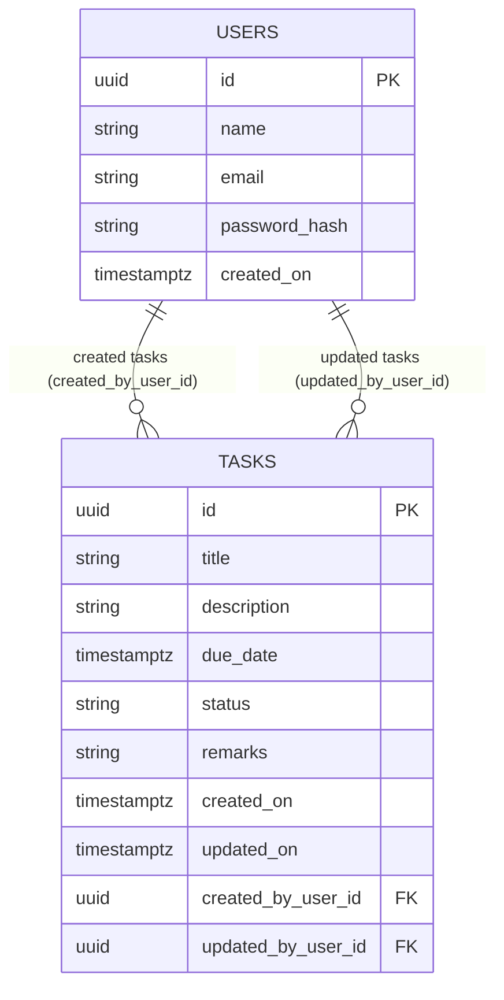

# Task Manager Application

> Full-stack task management application built with **ASP.NET Core Web API + PostgreSQL** on the backend and **Angular 18 SPA** on the frontend.  
> Implements full **CRUD + Search** for tasks, with proper tracking of timestamps and user attribution.

---

## Overview

- **Architecture**: Clean, layered architecture following an MVC-style separation:
  - **Model**: Domain entities (`TaskItem`, `User`) and EF Core mappings.
  - **Controller**: ASP.NET Core API controllers (`TasksController`, `AuthController`).
  - **View**: Angular SPA (task list, create, edit, details pages).
- **Tech Stack**:
  - **Backend**: .NET (ASP.NET Core Web API), EF Core, PostgreSQL, JWT authentication, Serilog, Swagger.
  - **Frontend**: Angular 18, standalone components, Angular Router, HttpClient.
- **Core Features**:
  - Create, read, update, delete tasks.
  - Search tasks by title/description/remarks/status.
  - Track `CreatedOn`, `UpdatedOn`, `CreatedBy` (user name + ID), `LastUpdatedBy` (user name + ID).
  - Authentication (register/login) with JWT-secured APIs.

Backend code is under `backend/`, frontend under `frontend/`.

---

## Database Design

### ER Diagram (Conceptual)



### Data Dictionary

#### Table: `users`

| Column        | Type                | Nullable | Description                       |
|--------------|---------------------|----------|-----------------------------------|
| `id`         | `uuid`              | No       | Primary key.                     |
| `name`       | `varchar(100)`      | No       | Display name of the user.        |
| `email`      | `varchar(200)`      | No       | Unique login/email address.      |
| `password_hash` | `varchar(512)`   | No       | SHA-256 hash with salt.          |
| `created_on` | `timestamptz`       | No       | When the user was created.       |

#### Table: `tasks`

| Column              | Type                | Nullable | Description                                                     |
|---------------------|---------------------|----------|-----------------------------------------------------------------|
| `id`                | `uuid`              | No       | Primary key.                                                    |
| `title`             | `varchar(200)`      | No       | **Task Title** (searchable, indexed).                           |
| `description`       | `varchar(2000)`     | No       | **Task Description**.                                           |
| `due_date`          | `timestamptz`       | Yes      | **Task Due Date**.                                              |
| `status`            | `varchar(50)`       | No       | **Task Status** (e.g. `Pending`, `InProgress`, `Completed`).    |
| `remarks`           | `varchar(1000)`     | No       | **Task Remarks** / comments.                                    |
| `created_on`        | `timestamptz`       | No       | **Created On** timestamp (UTC).                                 |
| `updated_on`        | `timestamptz`       | No       | **Last Updated On** timestamp (UTC).                            |
| `created_by_user_id`| `uuid`              | No       | **Created By** user ID → FK to `users.id`.                      |
| `updated_by_user_id`| `uuid`              | No       | **Last Updated By** user ID → FK to `users.id`.                 |

The frontend and API DTOs expose both **user ID** and **user name** for `CreatedBy` and `UpdatedBy` via joins.

### Indexes Used

From the EF Core model and initial migration:

- Table `users`:
  - `IX_users_email` – **unique** index on `email` for fast lookup and uniqueness.
- Table `tasks`:
  - `IX_tasks_title` – index on `title` (supports search/filter).
  - `IX_tasks_status` – index on `status` (supports filtering by status).
  - `IX_tasks_due_date` – index on `due_date` (supports due-date queries).
  - `IX_tasks_created_by_user_id` – index on FK for joins by creator.
  - `IX_tasks_updated_by_user_id` – index on FK for joins by last updater.

**Note**: Text search uses `ILIKE '%query%'` on title/description/remarks/status. For very large datasets, consider adding PostgreSQL trigram (`pg_trgm`) GIN indexes on these columns for faster wildcard search.

### Code-First vs DB-First

- The project uses **code-first** EF Core:
  - Entities are defined in `TaskManager.Domain.Entities`.
  - Fluent configuration is in `ApplicationDbContext` (`TaskManager.Infrastructure.Persistence`).
  - Schema is created via EF Core **migrations** (`TaskManager.Infrastructure.Migrations`).
- On startup (in development/Docker), the API runs `Database.Migrate()` and applies seed data (`SeedData.EnsureSeedDataAsync`).

---

## Application Structure (Backend)

Root: `backend/`

- `TaskManager.Domain`
  - Contains **domain entities**: `TaskItem`, `User`.
- `TaskManager.Application`
  - **DTOs**: Auth and Tasks (request/response and search DTOs).
  - **Interfaces**: `ITaskService`, `IAuthService`, `ICurrentUserService`, `IUnitOfWork`, repositories.
  - **Services (Application layer)**: `TaskService`, `AuthService` – implement business logic and orchestrate repositories.
- `TaskManager.Infrastructure`
  - **Persistence**: `ApplicationDbContext` (EF Core DbContext) with full mappings and indexes.
  - **Repositories**: `GenericRepository`, `TaskRepository`, `UserRepository`.
  - **Unit of Work**: `UnitOfWork` aggregates repositories and coordinates `SaveChanges`.
  - **Security**: JWT token generation helpers.
  - **Migrations**: Initial schema, snapshot.
- `TaskManager.API`
  - **Controllers**: `TasksController`, `AuthController`.
  - **Middleware**: `ExceptionHandlingMiddleware` (unified API error responses).
  - **Services**: `CurrentUserService` to resolve current user from JWT claims.
  - **Startup**: `Program.cs` configures DI, EF Core, JWT, CORS, Swagger, logging, DB migrations/seed.
  - **Configuration**: `appsettings.Development.json`, `appsettings.example.json`, Dockerfile.

This layering ensures **Models**, **Controllers**, and **business logic/services** are cleanly separated and testable.

---

## Frontend Structure (Angular SPA)

Root: `frontend/src/app/`

- `app.component.ts` – root shell with navbar + router outlet.
- `app.routes.ts` – route configuration:
  - `/login`, `/register`
  - `/tasks` (protected by `authGuard`):
    - `/tasks` – task list + search.
    - `/tasks/create` – create task.
    - `/tasks/:id` – task details.
    - `/tasks/:id/edit` – edit task.
- `core/`
  - `models/` – TypeScript interfaces for `Task`, `TaskCreateRequest`, `TaskUpdateRequest`, `AuthResponse`, etc.
  - `services/` – `TaskService` (CRUD + search), `AuthService` (login/register + token storage).
  - `guards/` – `authGuard` to protect task routes based on JWT presence.
  - `interceptors/` – `authInterceptor` attaches `Authorization: Bearer <token>` to API calls.
  - `components/navbar` – top navigation bar with login/register vs tasks/logout links.
- `features/auth/`
  - Login and registration components with forms bound to backend auth endpoints.
- `features/tasks/`
  - `task-list` – shows list of tasks, search box, status filter, delete action.
  - `task-create` – wraps `task-form` for creation.
  - `task-edit` – loads existing task and wraps `task-form` for update.
  - `task-details` – read-only task view including metadata (timestamps and CreatedBy/UpdatedBy).
  - `task-form` – reusable reactive form (title, description, due date, status, remarks + validation).

Environment configs:

- `src/environments/environment*.ts` – specify `apiBaseUrl` (default `http://localhost:5001/api`).

---

## Build & Install Steps

### Prerequisites

- **Backend**:
  - .NET SDK 8.x (or matching version of the projects).
  - PostgreSQL 15+ (local installation or Docker).
- **Frontend**:
  - Node.js 18+.
  - npm (comes with Node).

### Backend – Setup

From repo root:

```bash
cd backend

# Restore and build
dotnet restore
dotnet build
```

### Frontend – Setup

From repo root:

```bash
cd frontend
npm install
```

---

## Environment Details

### Database Configuration (PostgreSQL)

Default local development settings:

- **Database name**: `taskmanagerdb`
- **User**: `taskuser`
- **Password**: `taskpassword`

Example setup in `psql`:

```sql
CREATE USER taskuser WITH PASSWORD 'taskpassword';
CREATE DATABASE taskmanagerdb OWNER taskuser;
```

**Backend connection string** (development):

- Stored in `backend/TaskManager.API/appsettings.Development.json`:

```json
"ConnectionStrings": {
  "DefaultConnection": "Host=localhost;Port=5432;Database=taskmanagerdb;Username=taskuser;Password=taskpassword"
}
```

For deployment (e.g., Railway), the app can also read connection info from environment variables (`DATABASE_URL`, `POSTGRES_URL`, `PGHOST`, `PGUSER`, etc.), and converts URL-style strings to Npgsql format automatically (`Program.cs`).

### Authentication / JWT

Configuration section (`Jwt`) in `appsettings.Development.json` / `appsettings.example.json`:

- `Issuer`, `Audience`, `SecretKey`, `ExpiryMinutes`.
- **Important**: For real deployments, **replace** `SecretKey` with a strong, random string (32+ chars) and adjust issuer/audience as needed.

Password hashing:

- Configured via `Auth:PasswordSalt` in appsettings.
- `AuthService` uses SHA-256 + configured salt.

### Frontend Environment

`frontend/src/environments/environment*.ts`:

- `production`: boolean flag.
- `apiBaseUrl`: base URL of the backend API, e.g.:

```ts
export const environment = {
  production: false,
  apiBaseUrl: 'http://localhost:5001/api'
};
```

Adjust this URL when deploying backend behind a different host/port.

---

## Dependencies (High-Level)

### Backend

- **ASP.NET Core** – Web API framework.
- **Entity Framework Core** – ORM for PostgreSQL (Npgsql provider).
- **Npgsql** – PostgreSQL ADO.NET provider.
- **Serilog** – structured logging.
- **Swashbuckle / Swagger** – API documentation and UI.

All concrete versions are defined in the `.csproj` files and resolved via `dotnet restore`.

### Frontend

- **Angular 18** – SPA framework.
- **RxJS** – reactive programming utilities.
- **Angular Router** – routing for auth/tasks pages.
- **Angular HttpClient** – HTTP communication with backend.

Exact versions are pinned in `frontend/package.json` / `package-lock.json`.

---

## Run Instructions

### 1. Start PostgreSQL

Option A – Local PostgreSQL:

1. Install PostgreSQL.
2. Create DB and user as shown in the **Environment Details** section.

Option B – Docker (database only):

```bash
docker run -d --name taskmanager-db -p 5432:5432 \
  -e POSTGRES_USER=taskuser \
  -e POSTGRES_PASSWORD=taskpassword \
  -e POSTGRES_DB=taskmanagerdb \
  postgres:15
```

### 2. Run Backend API

From repo root:

```bash
cd backend
dotnet run --project TaskManager.API
```

- Default URL (development): `http://localhost:5001`
- Swagger UI: `http://localhost:5001/swagger`

Migrations and seed data (default admin user + one task) are applied automatically in development/Docker environments.

### 3. Run Frontend (Angular)

From repo root:

```bash
cd frontend
npm install        # first time only
npm start          # or: ng serve
```

- Frontend dev URL: `http://localhost:4200`
- Ensure `environment.apiBaseUrl` points to the backend (`http://localhost:5001/api`).

### 4. Login / Test Flow

1. Start backend and frontend as above.
2. Register a new user (or use the seeded admin account if documented).
3. Login to obtain a JWT (stored in `localStorage`).
4. Navigate to `/tasks` to:
   - Create tasks.
   - View task list and details.
   - Edit tasks.
   - Delete tasks.
   - Search tasks (by title/description/remarks/status).

---

## Notes for GitHub / Deployment Readiness

- **No secrets should be committed**: `appsettings.example.json` contains sample placeholders; use that as a template and configure real secrets via environment variables or non-committed `appsettings.json`.
- **.gitignore** is present at root and within frontend to exclude build artifacts, `node_modules`, and other transient files.
- The solution is organized for clarity: backend and frontend are independently buildable and deployable, with clear README guidance.

